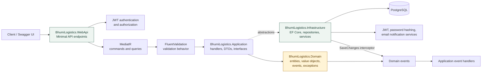
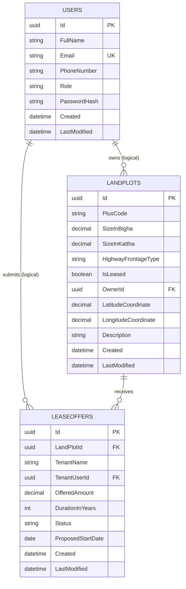
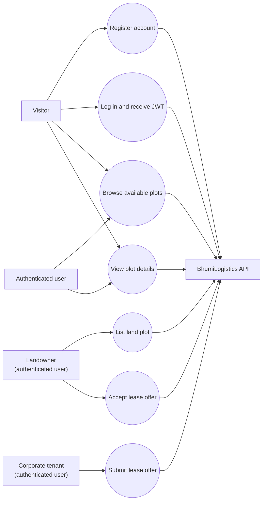

# BhumiLogistics Project Documentation

BhumiLogistics is a .NET 9 Minimal API for managing highway-connected commercial land plots and lease offers. The system supports account registration and login, authenticated land-plot listing, public plot discovery, lease-offer submission, and lease-offer acceptance.

## 1. Scope And Capabilities

### Main capabilities

- Register a user account and authenticate with JWT.
- List a highway-connected land plot as an authenticated user.
- Find available land plots, optionally filtered by highway frontage type.
- Retrieve a land plot and its lease offers by ID.
- Submit a lease offer against a land plot as an authenticated user.
- Accept an offer and mark the associated plot as leased.
- Translate domain and validation failures into consistent HTTP responses through global exception handling.

### Technology stack

| Area                | Technology                                                    |
| ------------------- | ------------------------------------------------------------- |
| Runtime             | .NET 9 / ASP.NET Core Minimal APIs                            |
| Application pattern | CQRS with MediatR                                             |
| Validation          | FluentValidation pipeline behavior                            |
| Persistence         | Entity Framework Core 9 with PostgreSQL/Npgsql                |
| Authentication      | JWT Bearer authentication and authorization                   |
| API description     | Swagger / OpenAPI                                             |
| Domain model        | Entities, value objects, domain events, and domain exceptions |

## 2. Architecture

The solution follows Clean Architecture. Dependencies point inward: the Web API composes the application and infrastructure services, while the application depends on domain abstractions and the infrastructure implements those abstractions.



### Layer responsibilities

| Layer          | Responsibility                                                                 | Representative locations                            |
| -------------- | ------------------------------------------------------------------------------ | --------------------------------------------------- |
| WebApi         | HTTP routing, authentication, Swagger, middleware, and thin endpoint delegates | `src/BhumiLogistics.WebApi/Endpoints`, `Program.cs` |
| Application    | Use cases, commands, queries, handlers, DTOs, interfaces, and validation       | `src/BhumiLogistics.Application/Features`           |
| Domain         | Business invariants and domain state transitions                               | `src/BhumiLogistics.Domain/Entities`                |
| Infrastructure | Persistence, EF mappings, repositories, tokens, hashing, and notifications     | `src/BhumiLogistics.Infrastructure`                 |

### Request flow

1. A client calls an endpoint under `/api`.
2. JWT authentication runs when the endpoint requires authorization.
3. The endpoint creates a MediatR command or query and delegates to `ISender`.
4. The validation behavior runs FluentValidation validators for applicable commands.
5. The handler loads or changes aggregates through application interfaces and repositories.
6. Domain methods enforce invariants such as valid lease amounts and leased-plot protection.
7. EF Core persists changes to PostgreSQL.
8. The save-changes interceptor dispatches domain events to application handlers.
9. The endpoint returns the appropriate HTTP result.

## 3. ER Diagram

The diagram shows the logical business relationships and the persisted tables represented by the EF Core model.



### Persistence notes

- `LandPlots` owns the `PlusCode` value object as the `PlusCode` column.
- `LandArea` is stored in `SizeInBigha` and `SizeInKattha` columns on `LandPlots`.
- `LandPlots -> LeaseOffers` is configured as a one-to-many relationship with cascade delete.
- `Users.Email` has a unique index.
- `OwnerId` and `TenantUserId` are stored as GUIDs, but the current EF configurations do not define database foreign keys to `Users`; the user relationships in the diagram are therefore logical application relationships.
- Enum values such as `Role`, `HighwayFrontageType`, and `Status` are persisted as strings.

## 4. Use-Case Diagram



### Use-case to endpoint mapping

| Use case               | Endpoint                                      | Authorization |
| ---------------------- | --------------------------------------------- | ------------- |
| Register account       | `POST /api/auth/register`                     | Public        |
| Log in                 | `POST /api/auth/login`                        | Public        |
| Browse available plots | `GET /api/land-plots/available`               | Public        |
| View plot details      | `GET /api/land-plots/{id}`                    | Public        |
| List land plot         | `POST /api/land-plots`                        | JWT required  |
| Submit lease offer     | `POST /api/lease-offers`                      | JWT required  |
| Accept lease offer     | `PUT /api/lease-offers/{leaseOfferId}/accept` | JWT required  |

## 5. Domain Model And Rules

### Aggregates

- **LandPlot** is an aggregate root. It owns its collection of `LeaseOffer` entities and controls whether new offers can be submitted.
- **LeaseOffer** represents a tenant proposal for one land plot.
- **User** represents an account and its role.

### Value objects

- **PlusCode** represents the plot's location code.
- **LandArea** represents land size using bigha and kattha values.

### Important invariants

- A land plot must have a non-empty owner ID.
- A lease amount must be greater than zero.
- Lease duration must be between 1 and 99 years.
- A proposed lease start date cannot be in the past.
- A leased plot cannot accept another offer or be marked leased again.

### Domain events

- Listing a plot raises `LandPlotListedEvent`.
- Submitting an offer raises `LeaseOfferSubmittedEvent`.
- Events are collected by the domain entity and dispatched by the persistence interceptor after changes are saved.

## 6. Security And Error Handling

- Login returns a signed JWT containing the authenticated user identity and role claims.
- The API validates issuer, audience, lifetime, and signing key for bearer tokens.
- The current user service reads identity information from the HTTP context.
- Passwords are stored as hashes, never as plaintext.
- `GlobalExceptionHandlingMiddleware` provides centralized handling for domain, validation, and unexpected exceptions.
- Replace the development JWT key and database credentials before deployment; do not commit production secrets.

## 7. Local Development

From the solution root:

```bash
dotnet restore
dotnet build
dotnet ef database update --project src/BhumiLogistics.Infrastructure --startup-project src/BhumiLogistics.WebApi
dotnet run --project src/BhumiLogistics.WebApi
```

Open the URL printed by ASP.NET Core and append `/swagger` in the Development environment.

### Typical Swagger walkthrough

1. Register with `POST /api/auth/register`.
2. Log in with `POST /api/auth/login` and copy the token.
3. Use Swagger's **Authorize** action with the token.
4. Create a plot, submit an offer, and accept the offer using the protected endpoints.

## 8. Project Structure

```text
BhumiLogistics.sln
├── src/BhumiLogistics.Domain
│   ├── Entities
│   ├── ValueObjects
│   ├── Events
│   ├── Exceptions
│   └── Enums
├── src/BhumiLogistics.Application
│   ├── Features/Auth
│   ├── Features/LandPlots
│   ├── Features/LeaseOffers
│   ├── Common/Behaviours
│   └── Common/Interfaces
├── src/BhumiLogistics.Infrastructure
│   ├── Persistence
│   ├── Migrations
│   └── Services
└── src/BhumiLogistics.WebApi
    ├── Endpoints
    ├── Middleware
    └── Program.cs
```
